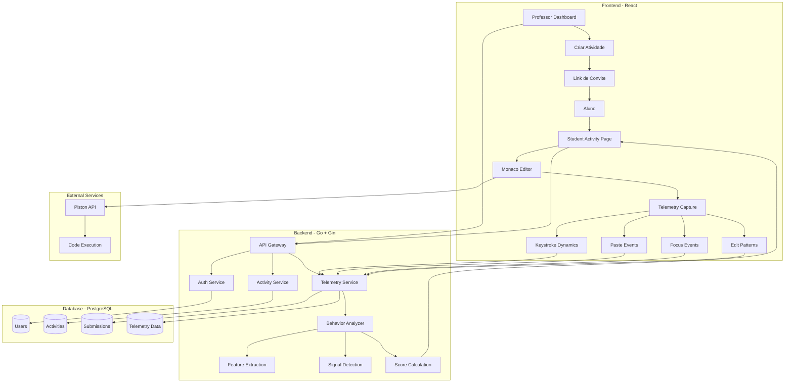
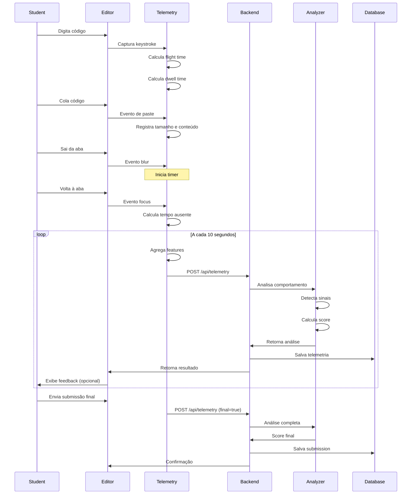
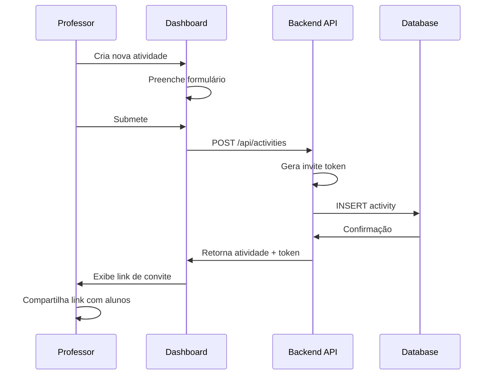
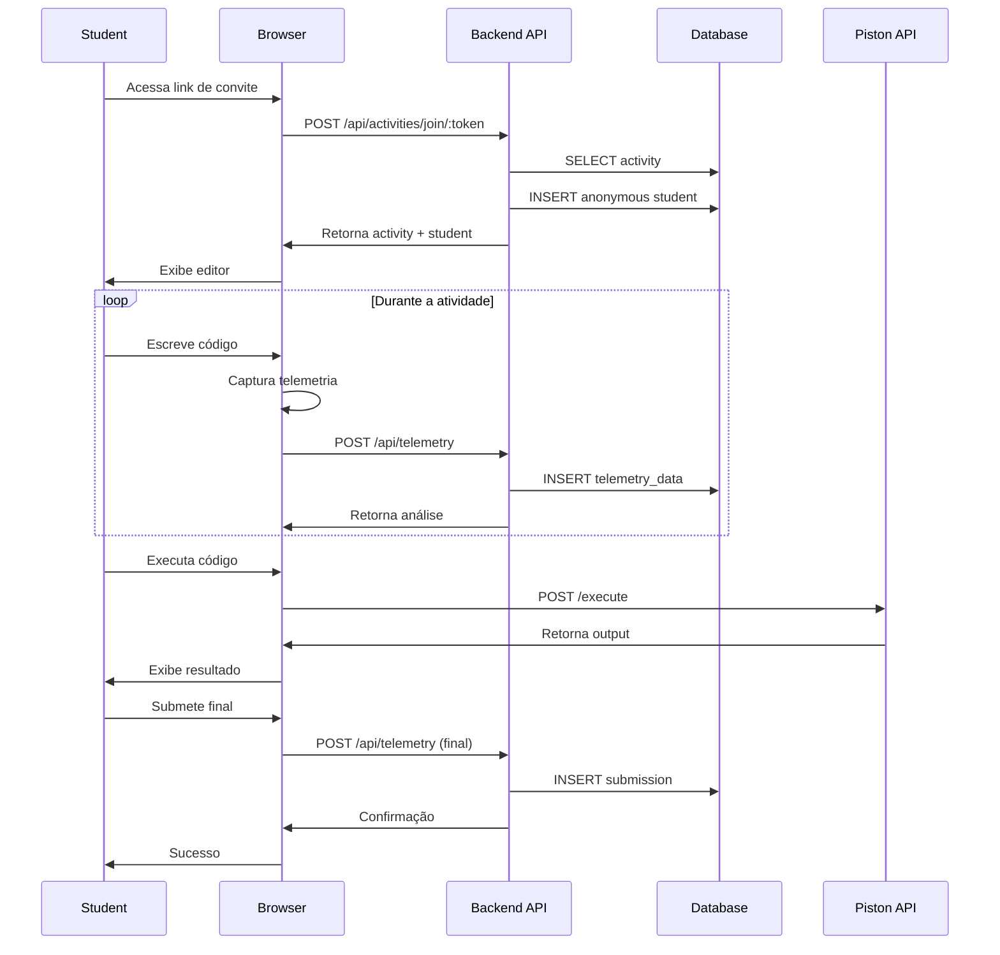
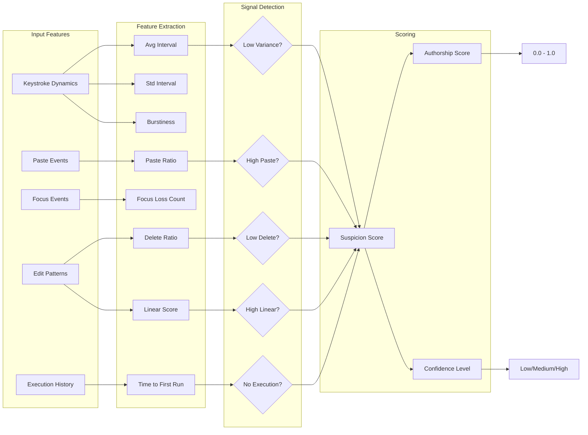
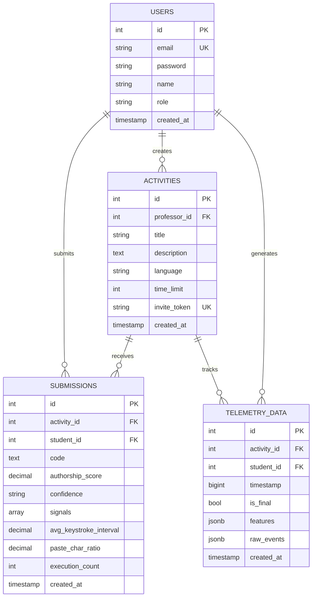
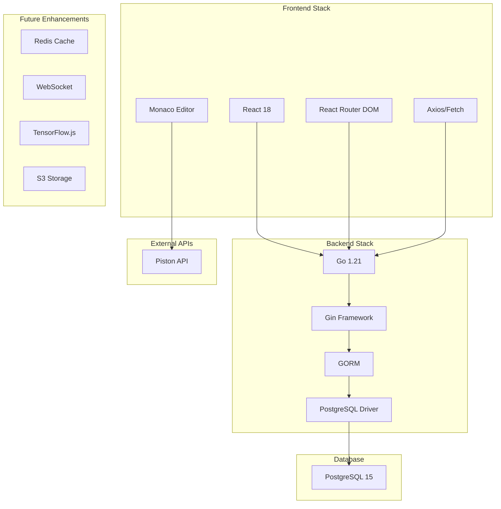
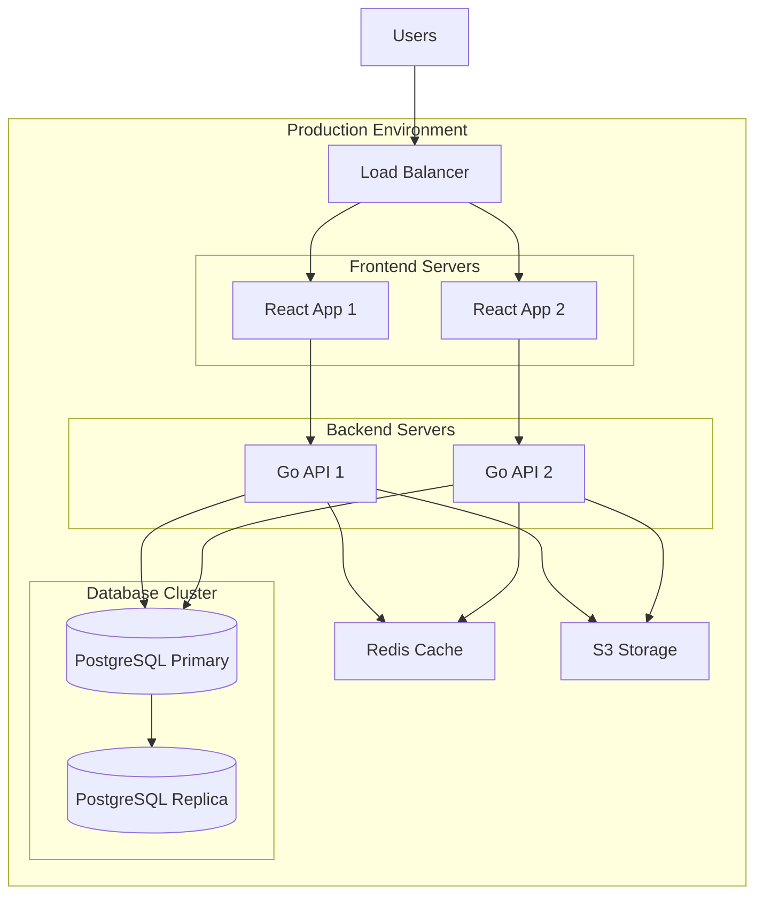
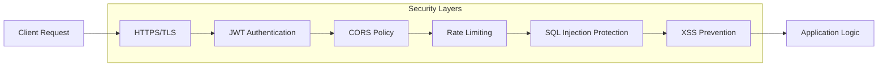

# Arquitetura do Sistema Dalivim

## Diagrama de Fluxo Completo



## Fluxo de Dados - Telemetria



## Fluxo de Criação de Atividade



## Fluxo do Aluno



## Arquitetura de Análise



## Modelo de Dados



## Stack Tecnológica



## Deployment Architecture



## Performance Metrics

### Telemetria
- **Frequência**: A cada 10 segundos
- **Payload médio**: ~2-5 KB
- **Latência esperada**: < 100ms

### Análise
- **Processamento**: Síncrono (< 50ms)
- **Score calculation**: O(n) onde n = features
- **Database writes**: Batch quando possível

### Code Execution
- **Piston API**: Timeout 3s
- **Retry logic**: 2 tentativas
- **Fallback**: Mensagem de erro amigável

## Security Considerations



## Análise de Features

### Features Primárias (Alto Peso)
1. **Paste Char Ratio** - Proporção de código colado
2. **Delete Ratio** - Taxa de deleções/correções
3. **Linear Editing Score** - Linearidade do código

### Features Secundárias (Médio Peso)
4. **Keystroke Variance** - Burstiness da digitação
5. **Execution Count** - Número de tentativas
6. **Focus Loss Count** - Saídas da aba

### Features Contextuais (Baixo Peso)
7. **Average Keystroke Interval** - Velocidade média
8. **Total Time** - Tempo total gasto
9. **Time to First Run** - Tempo até testar

## Score Calculation Formula

```
Suspicion Score = Σ(weight_i × signal_i)

where:
- weight_i = peso do sinal detectado
- signal_i = 1 se sinal presente, 0 caso contrário

Authorship Score = 1.0 - min(Suspicion Score, 1.0)

Confidence:
- High: ≥ 4 sinais detectados
- Medium: 2-3 sinais detectados
- Low: 0-1 sinais detectados
```
